# Investigating Control Areas in Table Tennis

Ce repo contient les fonctions et les notebooks pour permettre une analyse de l'occupation de l'espace de la part des joueurs.
Il contient aussi une étude des zones de frappes et de l'atteignabilité de celle-ci

> Aymeric Erades, Lou Peuch & Romain Vuillemot (2025). « Investigating Control Areas in Table Tennis ». Sixteenth International EuroVis Workshop on Visual Analytics (EuroVA), p6.

```
@inproceedings{erades:hal-05032405,
  TITLE = {{Investigating Control Areas in Table Tennis}},
  AUTHOR = {Erades, Aymeric and Peuch, Lou and Vuillemot, Romain},
  URL = {https://hal.science/hal-05032405},
  BOOKTITLE = {{Sixteenth International EuroVis Workshop on Visual Analytics (EuroVA)}},
  ADDRESS = {Luxembourg, France},
  YEAR = {2025},
  MONTH = Jun,
  KEYWORDS = {Table tennis ; Visualization ; Sports},
  HAL_ID = {hal-05032405},
}
```

## 1. Installation

`git clone https://github.com/centralelyon/tt-espace`  
`cd tt-espace`  
`pip install -r requirement.txt`  

## 2. TEST_code_nuage_frappes

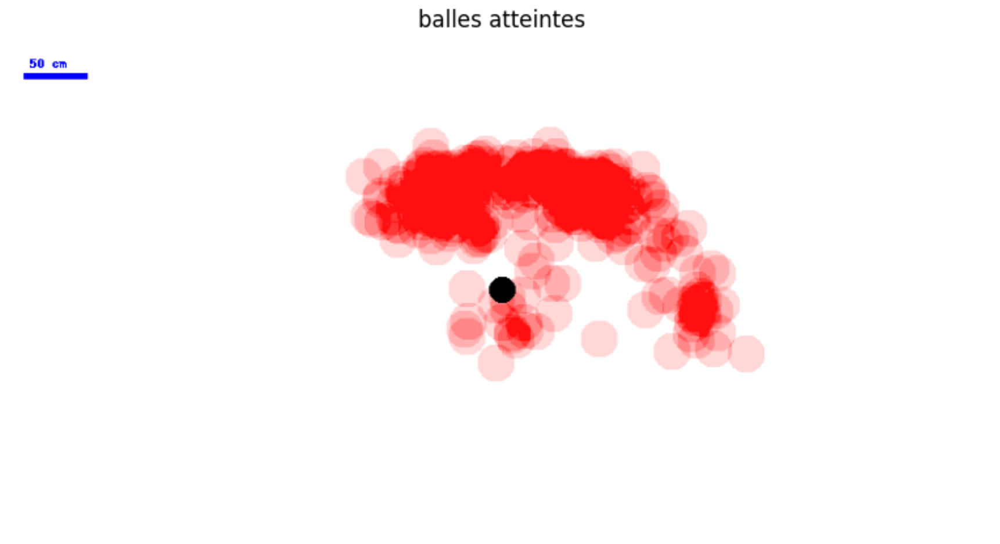
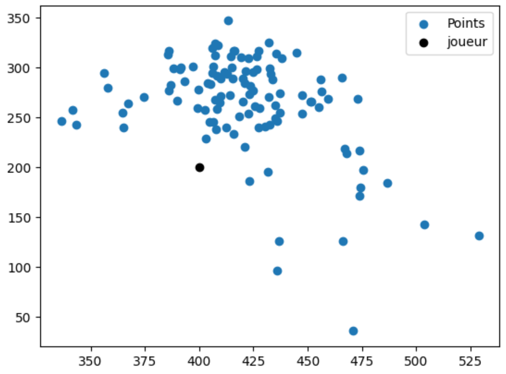
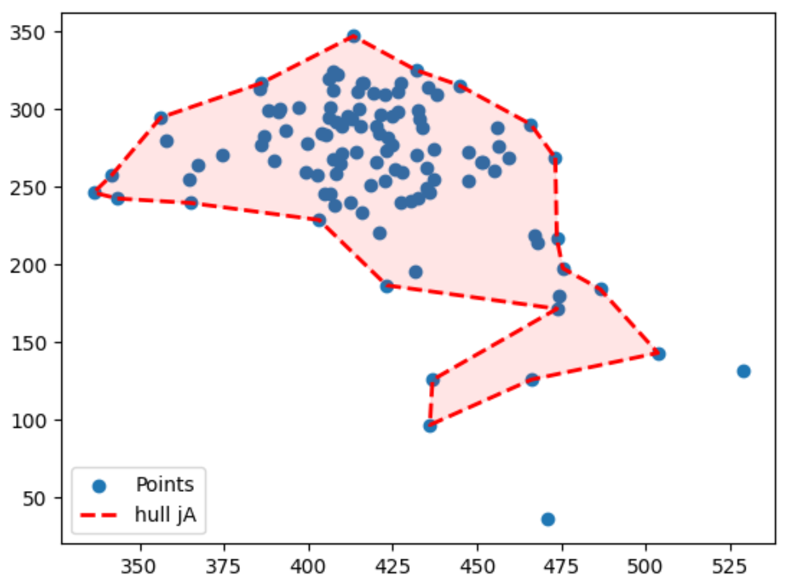
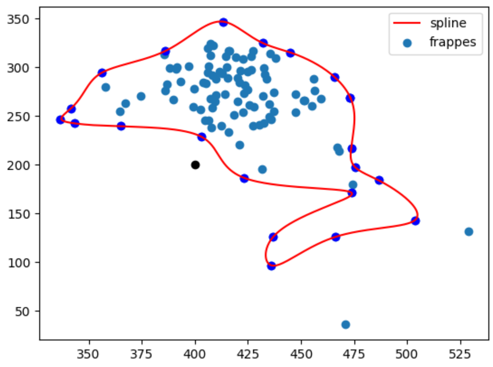
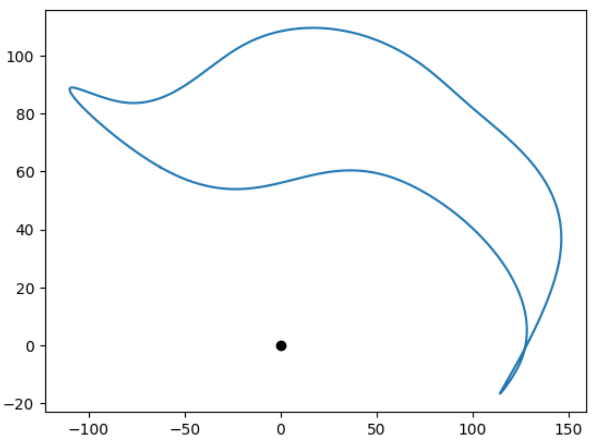


## 3. Code preliminaire


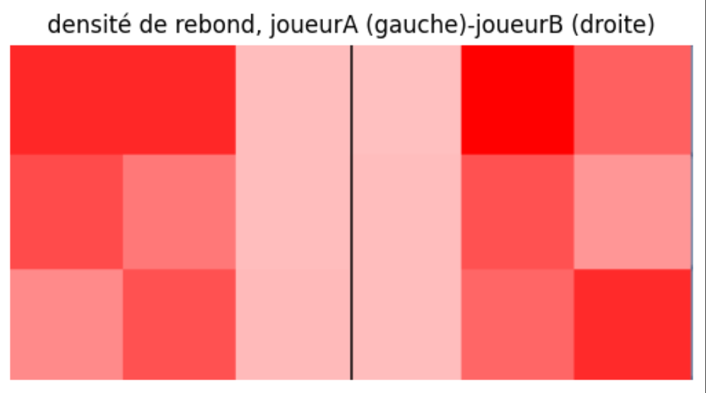
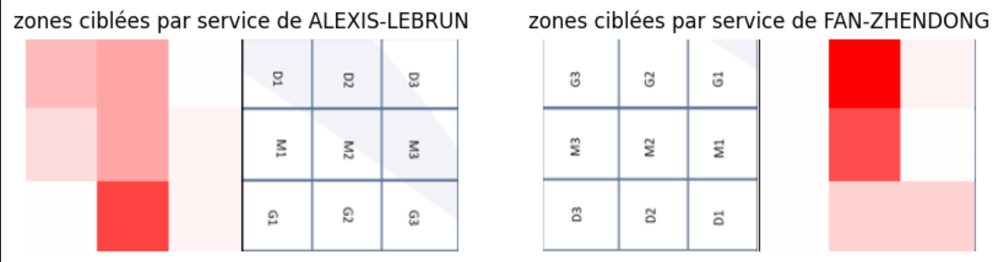
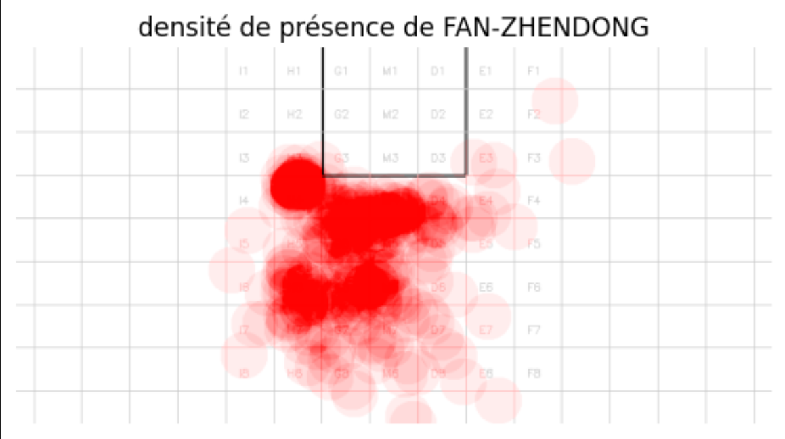

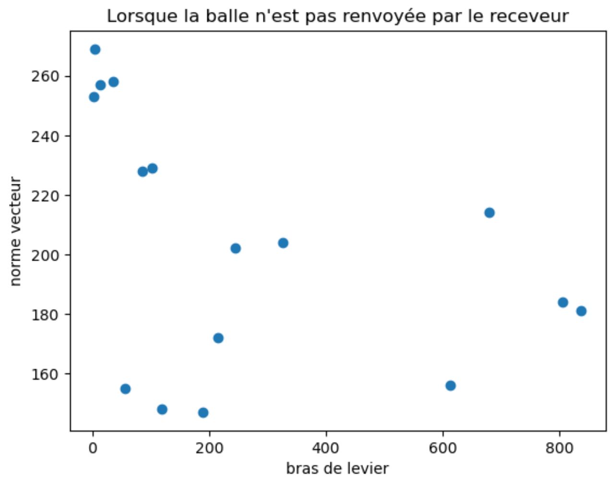

## 4. time_calc_inertia


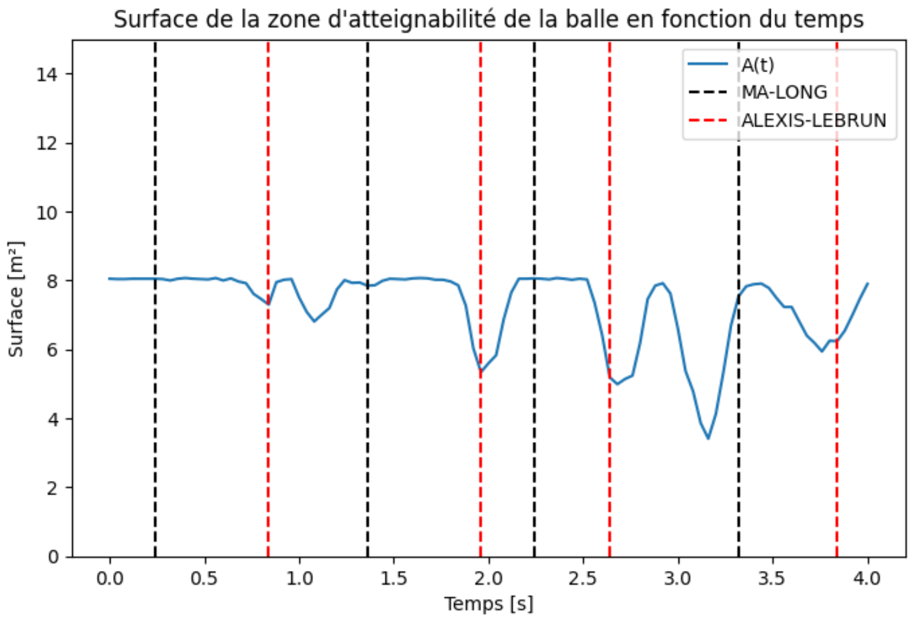
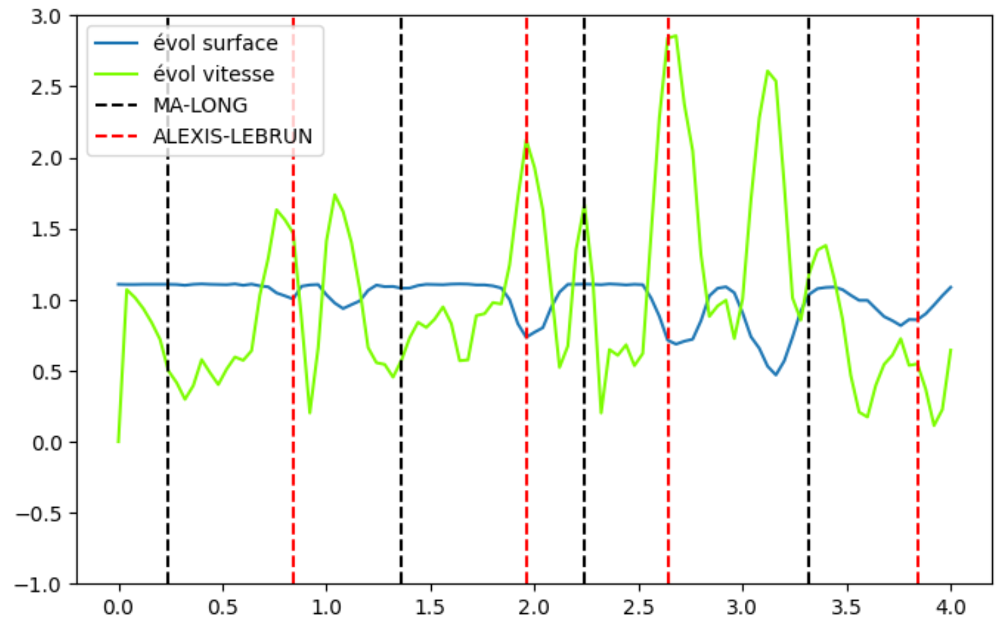
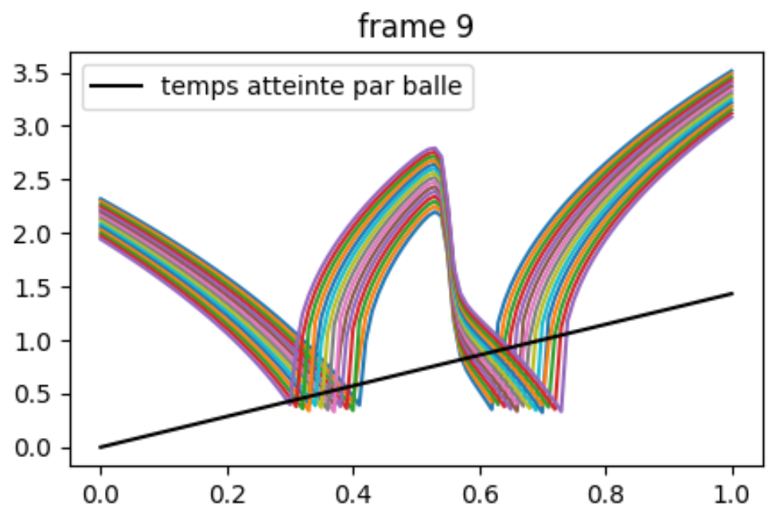
