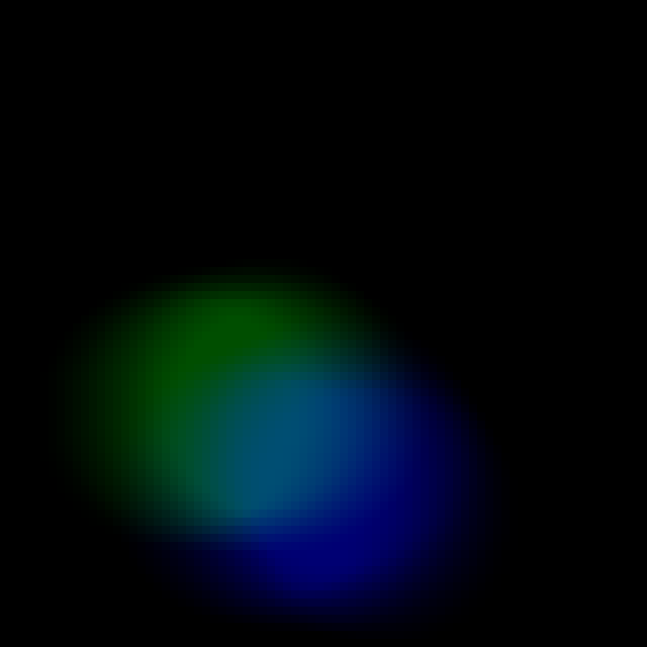

# Table tennis control areas

This repository details a method to create visuals to analyse control areas in table tennis. The goal is to find areas that a player can reach during points.  
We provide code to explore statistics of players' strokes and a code to create a control areas model

> Aymeric Erades, Lou Peuch & Romain Vuillemot (2025). « Investigating Control Areas in Table Tennis ». Sixteenth International EuroVis Workshop on Visual Analytics (EuroVA), p6.

```
@inproceedings{erades:hal-05032405,
  TITLE = {{Investigating Control Areas in Table Tennis}},
  AUTHOR = {Erades, Aymeric and Peuch, Lou and Vuillemot, Romain},
  URL = {https://hal.science/hal-05032405},
  BOOKTITLE = {{Sixteenth International EuroVis Workshop on Visual Analytics (EuroVA)}},
  ADDRESS = {Luxembourg, France},
  YEAR = {2025},
  MONTH = Jun,
  KEYWORDS = {Table tennis ; Visualization ; Sports},
  HAL_ID = {hal-05032405},
}
```

## 1. Install

- `git clone https://github.com/centralelyon/tt-espace`  
- `cd tt-espace`  
- `pip install -r requirement.txt`  

- In [config-sample.py](https://github.com/centralelyon/table-tennis-control-areas/blob/main/config-sample.py) change local repository path
- Rename config-sample.py to config.py

## 2. 1_stats_from_data.ipynb
This Notebook explores strike positions  
- Run all [1_stats_from_data](https://github.com/centralelyon/table-tennis-control-areas/blob/main/Notebooks/1_stats_from_data.ipynb) notebook  

First part of the notebook shows visual statistics of strike positions:
- Global strike positions

- Position relative to player
  

Second part of the notebook introduces convexe envelopes of strokes. Theses envolepes are used to characterize reachable areas for a player from his position.

  

In this second part, envelope csv files are created to be used by models

  


## 3. time_calc_inertia.ipynb 
This [Notebook](https://github.com/centralelyon/table-tennis-control-areas/blob/main/Notebooks/time_calc_inertia.ipynb) create heatmaps of reachables areas.

- First model uses Newton's Law. It computes for each point of the area how much it takes to reach it by players. Then we created heatmaps to translate these times
- - - Location: `example/{match}/{point}/heatmap`
 
  

- Second model uses envelope's csv. 2 colors are used to make a difference between forehand reachable areas and backhand reachable areas
- - Location: `example/{match}/{point}/envelope`

  

## 4. supperposition_image_model.py
This file provides functions to render heatmaps over the playing image. By running this file, all images are generated for the example of the first point of the match "ALEXIS-LEBRUN_vs_MA-LONG".
The process is as follows:
1. Compute heatmaps (Done in part 3)
2. Make homography of heatmaps using table position as a reference
3. Fuses heatmap and image
3. a. Separate the heatmap part above the table from the part on the ground
4. Compute the median image of the point
5. Subtract players


  
