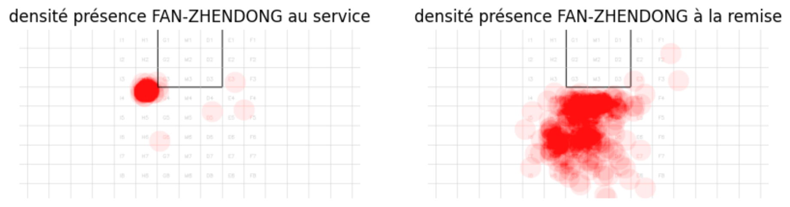

# tt-espace

Ce repo contient les fonctions et les notebooks pour permettre une analyse de l'occupation de l'espace de la part des joueurs.
Il contient aussi une étude des zones de frappes et de l'atteignabilité de celle-ci

## 1. Installation

`git clone https://github.com/centralelyon/tt-espace`  
`cd tt-espace`  
`pip install -r requirement.txt`  

## 2. TEST_code_nuage_frappes

## 3. Code preliminaire

## 4. time_calc_inertia

